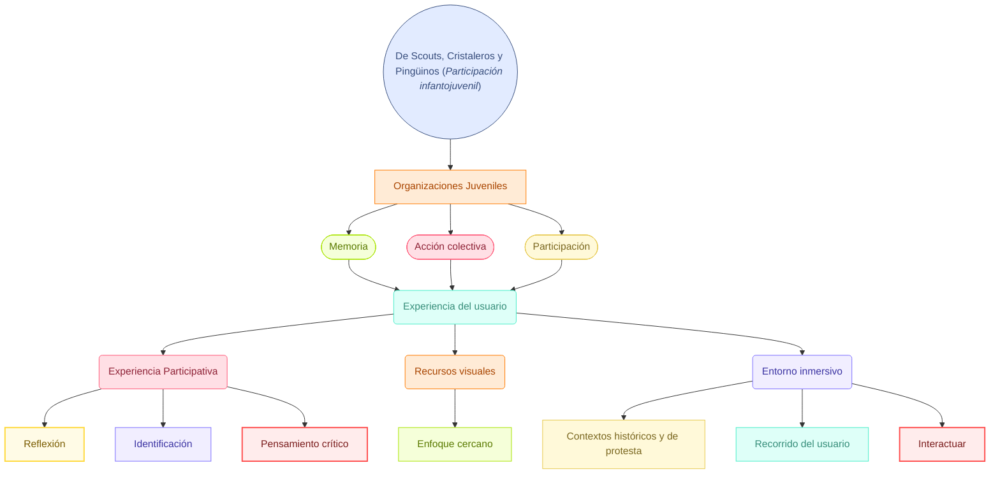

# CLASE 01

Apuntes de clases, primer semestre 2026, Universidad Diego Portales

---

# Mermaid.ai

```mermaid
flowchart TD
    A["De Scouts, Cristaleros y Pingüinos (<i>Participación infantojuvenil</i>)"]
    A --> B[Organizaciones Juveniles]
    B --> C[Participación]
    B --> D[Acción colectiva]
    B --> E[Memoria]
    E --> F[Experiencia del usuario]
    D --> F
    C --> F
    F --> G[Experiencia Participativa]
    G --> H[Reflexión]
    G --> I[Identificación]
    G --> J[Pensamiento crítico]
    F --> K[Recursos visuales]
    K --> L[Enfoque cercano]
    F --> M[Entorno inmersivo]
    M --> N[Contextos históricos y de protesta]
    M --> O[Recorrido del usuario]
    M --> P[Interactuar]

A:::Sky
B:::Sunset
C:::YellowSoft
D:::Rose
E:::Lime
F:::Aqua
G:::Rose
H:::Highlight
I:::Concept
J:::Alert
K:::Sunset
L:::Lime
M:::Concept
N:::YellowSoft
O:::Aqua
P:::Alert

A@{ shape: circle}
C@{ shape: stadium}
D@{ shape: stadium}
E@{ shape: stadium}
F@{ shape: rounded}
G@{ shape: rounded}
K@{ shape: rounded}
M@{ shape: rounded}

    classDef Highlight stroke-width:2px, stroke:#FFD93D, fill:#FFFBE6, color:#7A5C00
    classDef Concept stroke-width:1px, stroke:#7C6EFF, fill:#F1EEFF, color:#3D35A3
    classDef Alert stroke-width:2px, stroke:#FF4D4D, fill:#FFECEC, color:#7A1C1C
    classDef Sunset stroke-width:1px, stroke-dasharray:none, stroke:#FF7A00, fill:#FFEBD6, color:#A94500
    classDef Sky stroke-width:1px, stroke-dasharray:none, stroke:#374D7C, fill:#E2EBFF, color:#374D7C
    classDef YellowSoft stroke-width:1px, stroke-dasharray:none, stroke:#E6C84C, fill:#FFF9D9, color:#7A6720
    classDef Rose stroke-width:1px, stroke-dasharray:none, stroke:#FF5978, fill:#FFDFE5, color:#8E2236
    classDef Lime stroke-width:1px, stroke-dasharray:none, stroke:#A8E400, fill:#F5FFD9, color:#5A7A00
    classDef Aqua stroke-width:1px, stroke-dasharray:none, stroke:#46EDC8, fill:#DEFFF8, color:#378E7A
```
