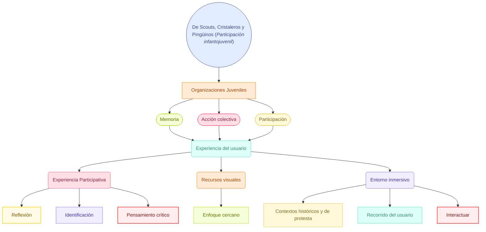

## TALLER DE OBJETOS Y ESPACIOS / MUSEOGRAFÍA

`Correción Encargo 02- grupo 4`

PRESENTACIÓN

  - Tildes en los apellidos de las profes.
  - Hay algunos párrafos que están justificados y otros no.
  - Las imágenes deben acompañar los textos.
  - Colocar citas maás actualizadas y hacer una comparación con la otra cita. Tipo educación montessori y contraponer.
  - Los referentes deben ir siempre con su decripción, quién lo hizo, etc.
  - *Verlo desde una perspectiva de interacción digital*
  - Referencia a la protesta estudiantil, no tanto al estadillo social (ejemplo: las sillas en la reja L1)

FORMA

1. El público objetivo son los adolescentes (no niños) siempre hablar de los adolescentes.✅
2. La cita debe ser más actualizada y hacer una comparación con la cita antigua. ❌
3. En el estudio del espacio, no hablar sobre como está hecho el edificio. Sino realizar el estudio del lugar en el que expondremos, la sala de *La Galeria de la memoria*. Cuál es el flujo del recorrido desde el metro hasta la sala y como la gente se mueve a través de la exposición.✅
4. En la línea de tiempo, colocar bien las fechas y distancias reales. Que año va primero y cual va después. Que tenga relación los períodos.
5. Bien las descripciones de los períodos, pero la imágenes deben acompañar los textos.✅
6. Objetivo Principal: realizar otro objetivo, el que está es de momento ciudadano, debemos sacar conceptos desde ahí.✅
   - Desde el diseño: ¿Qué queremos que quede? ¿Cómo lo hacemos?
   - Como lo haré desde el diseño, el tono (queremos vernos disruptivos), lo inmersivo, etc. NO desde la sociología
   - Si queremos que la exposición no sea líneal, desde ahí hay un punto para el objetivo
7. Objetivos específicos: ¿Cómo lo voy a hacer desde lo digital?✅
8. La conceptualización es de las guías de las profes, debemos conceptualizar desde NUESTRO punto de vista, desde lo que queremos lograr y realizar.✅
9. Arreglar el texto síntesis en base a los conceptos de NOSOTROS✅
   - Analizar la información, para donde queremos llegar.
10. Mapa conceptual: si o si se arregla✅
11. Referentes conceptuales: Son referentes expositivos, sensaciones que queremos lograr en la exposición (ejemplo: queremos que la gente recuerden las salas de clases, por ende presentaremos una mesa). Son las definiciones claves para realizar el proyecto.
   - Los referentes no son contextos
   - Los referentes de las gráficas > paleta de color - tipografía - diagramación de lo que queremos representar en la exposición. Referentes digitales (redes sociales)
   - Todos los referentes deben ir con nombre y fecha.❌

---

Encargo 03

Van a intenar a limitar en 10 min
- estudios previos: contenidos ya arriba de rodrigo mallorca
- propuesta curatorial, orden d elos contenidos y orden narrativos, los quiero ordenar de manera cronologica, de atras hacia adelante, ordenarlo en torno al colegio, uniforme etc.  siempre por qué, ordenarlos narrativamente. desayuno, almuerzo, recreo ordenar los contenidos en base a la propuesta
- como nosotros nos vamos a posicionar en base a los contenidos que nos entregan
- corregir todo
- desarrollar dos propuestas graficas y espacial. van de la mano
- 1 afiche
- moodboard de materialidad
- definicion del orden espacial d elos contenudos, ligado con el curatorial, orden concentrico. ejemplo: quiero que mi expo sea lineal porque es cronologica
- el orden de los contenidos me da la definicion del recorrido
- como ocupar el espacio en base a un modulo
- hacer animación si es que lo requerimos, traer mas de lo que piden

---

# Mermaid.ai

---

- referentyes conceptuales: salas de clases en chile > la exposicion hacemos una supermesa y toda la gente s epuede sentar y escribir (QUE TENGA LA COHERENIA)
- todos los referentes venían sin nombre, sin referentes, sin nada. El referente insumos para proyectar lo que queremos dar y visualizar. acercarse a los referentes desde los conceptos que estamos trabajando
- los referentes no son contextos, ejemplo los referentes de las gráficas. NO ES LA MANERA EN LA QUE QUIERO MOSTRAR LA EXPOSICION DEL CONTEXTO CIUDADANO.
- PALETA DE COLOR, TIPOGRAFÍA, DIAGRAMACION DE LO QUE QUEREMOS REPRESENTAR EN LA EXPOSICIÓN
- Los referentes conceptuales, son referentes expositivos, sensaciones que queremos lograr en la exposición (ejemplo: queremos que la gente recuerde las salas de clases, por ende presentamos una mesa) 
- logo hecho en el 85
- tildes en los apellidos de las profes
- entregables editoriales: tipo fanzine
- Forma: la presentación en sí fijarse que los párrafos están justificados y otros no. REVISAR BIEN LOS GRÁFICOS. Las imagenes tienen que ir acompañando a los textos.
- Bien lo del público objetico, son todos los jovenes (adolescentes) tener cuidado con los conceptos
- bien la cita
- temáticas de la educacion cambian tanto y colocar citas tan antiguas no tiene relación con la actualidad. colocar citas más actualizadas. Una cita más actual, tipo cita de la educacion montessori y contraponer y hacer la comparacion con la otra cita.
- Centrarse en donde estaremos exponiendo, en la sala de donde estaremos, buscar más información y como esta el flujo del recorrido desde el metro
- en la linea de tiempo colocar bien las fechas y separarlas por fechas, no por períodos. Arreglar la linea de tiempo, ser dos lineas de tiempo con fechas correlativas. los cristaleros van primero y organizar como colocar la información
- podemos estar en desacuerdo con los temas que nos pasan y podemos aportar otra visión. HAY QUE CUESTIONAR TODO, podemos cuestionar en como estan definidos los perdiodos
- objetivo principal: usamos los conceptos de momento ciudadano, presentar otro objetivo y sacar conceptos desde ahí.
- como lo voy a hacer desde el diseño, desde el tono, si es inmersivo, etc. NO desde la sociología
- superposición (supersociions de las fechas de la linea de tiempo)
- analizar la informacion para donde llegaremos, diseñar la exhibicoon
- queremos que la exposion no sea lineal y ahi hay un punto para el objetivo principal
- muy enfocados en lo que quiere lograr la fundacion y no lo que queremos lograr nosotros con la exposicción
